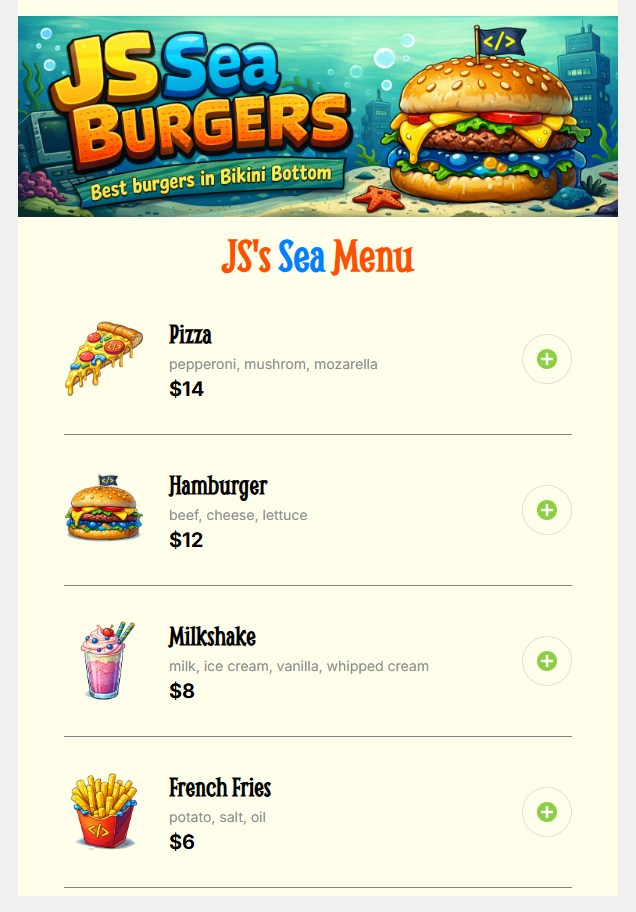

# 🍔 JS Sea Burgers - Food Ordering App

A responsive food ordering web application inspired by the flavors of Bikini Bottom. Built as part of a JavaScript challenge to practice dynamic UI rendering and array methods.

## 🚀 Features

- **Dynamic Menu Rendering**: Menu items are generated dynamically from a data array using the `.map()` method.
- **Modern UI**: Clean, mobile-first design with a focus on usability.
- **Responsive Layout**: Optimized for 600px width with custom-styled cards.
- **Modular Code**: Organized with ES6 modules (`import`/`export`) for better maintainability.

## 🛠️ Tech Stack

- **HTML5** (Semantic markup)
- **CSS3** (Flexbox, custom properties/variables)
- **JavaScript (ES6)** (Array methods, DOM manipulation)

## 📸 Preview

_Main Screen:_


## 📦 How to Run

1. Clone the repository:
   ```bash
   git clone [https://github.com/your-username/js-sea-burgers.git](https://github.com/your-username/js-sea-burgers.git)
   ```
